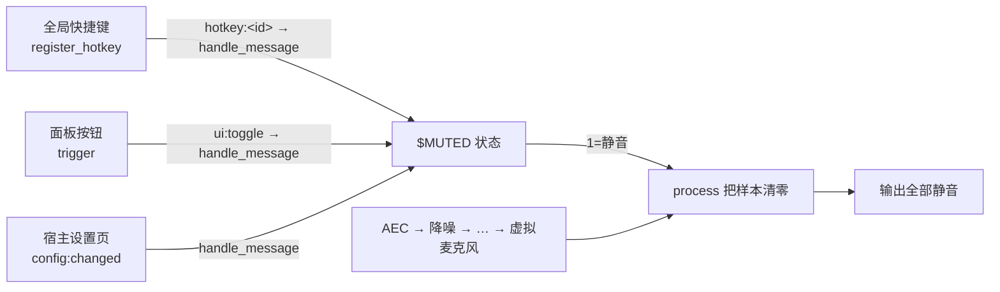

# Global Mute（全局静音，WASM 示例）

纯 WASM 全局静音插件：注册一个全局快捷键，一键静音/取消静音。静音通过**加入音频处理链**的方式实现——插件作为 DSP 链首节点，在静音状态下把每一帧音频样本清零，因此虚拟麦克风 / 扬声器输出全部静音，实现真正的「全局静音」。

- 运行时：WASM（wasmi 沙箱）
- 演示 API：`register_hotkey` / `process`（DSP 节点）/ `get_config` / `set_config` / `set_panel_icon` / 面板 `trigger` / 快捷键录制
- 源码：`globalmute.wat`

## 构建产物

插件唯一需要构建的产物是 `globalmute.wasm`（从 `globalmute.wat` 编译）。`panel.html` / `plugin.json` 是文本文件，无需构建。

```bash
npm install -g wabt
wat2wasm globalmute.wat -o globalmute.wasm
```

打成本地可导入的 zip（用宿主 CLI，从 `tauri-app/` 运行）：

```bash
cargo run -p micyou-cli -- plugin validate ./path/to/wasm-globalmute   # 校验
cargo run -p micyou-cli -- plugin package ./path/to/wasm-globalmute -o globalmute.zip
```

## 工作原理



- manifest 声明 `kind: "dsp"` 与 `dsp: { "first": true }`，宿主把节点插入处理链最前（AEC 之前）
- `process` 在静音时把整帧样本清零并返回 0（宿主读回修改后的数据），非静音时直接透传
- `register_hotkey` 注册全局快捷键，按下后宿主投递 `{"shortcut":"..."}` 到 `handle_message`，插件切换静音并 `set_config` 持久化
- 面板按钮与宿主设置页的 `config:changed` 热更新走同一 `handle_message` 入口

## 配置

| 键         | 类型    | 默认值         | 说明                                                                                                                                                            |
| ---------- | ------- | -------------- | --------------------------------------------------------------------------------------------------------------------------------------------------------------- |
| `muted`    | boolean | `false`        | 当前静音状态（可在宿主设置页手动开关，热更新）                                                                                                                  |
| `shortcut` | string  | `ctrl+shift+m` | 全局快捷键；在插件面板单击快捷键框**录制**，Esc 取消，可**重置**默认；保存后**立即生效**（宿主无注销热键 API，旧的残留热键触发会被插件按 payload 比对自动忽略） |

## 使用

1. 把 `wasm-globalmute` 整个目录放入宿主插件目录（Linux `~/.config/micyou/plugins/`，Windows `%APPDATA%\micyou\plugins\`）
2. 在宿主设置 → 插件中启用「全局静音」
3. 按下全局快捷键（默认 `Ctrl+Shift+M`）即可一键全局静音/取消静音；也可在插件面板或设置页操作
4. **录制快捷键**：单击面板中的快捷键框（参考 MC 按键绑定交互），按下新的组合键（如 `Ctrl+Shift+K`）即保存并立即生效，`Esc` 取消，`重置` 恢复默认

## 平台注意

- 全局快捷键依赖宿主 `global-shortcut`：Windows / macOS / Linux X11 会话可用
- **Linux Wayland 会话不支持全局快捷键**（合成器不转发 X11 全局抓取，宿主注册会明确报错），请使用插件面板按钮或设置页开关
- WASM DSP 节点按宿主 best-effort 处理（解释执行无法保证实时性），本插件逻辑极简（仅逐样本写零），实测远低于帧预算
